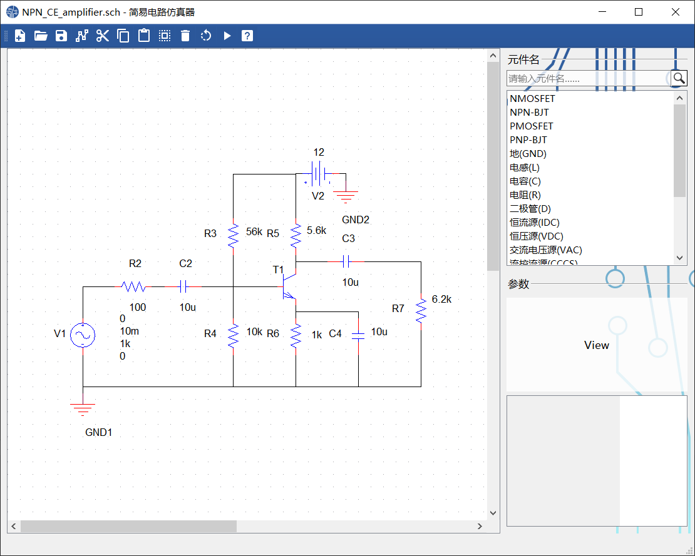
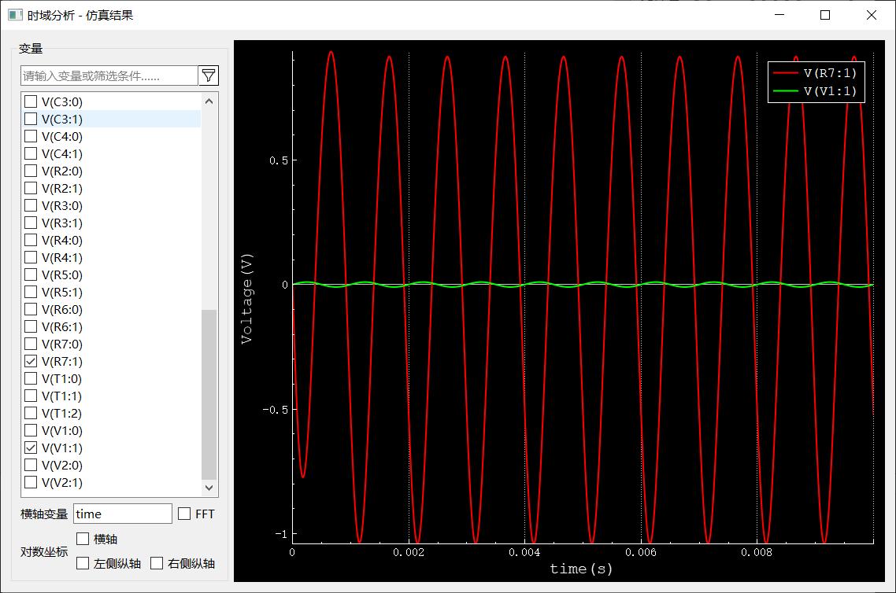
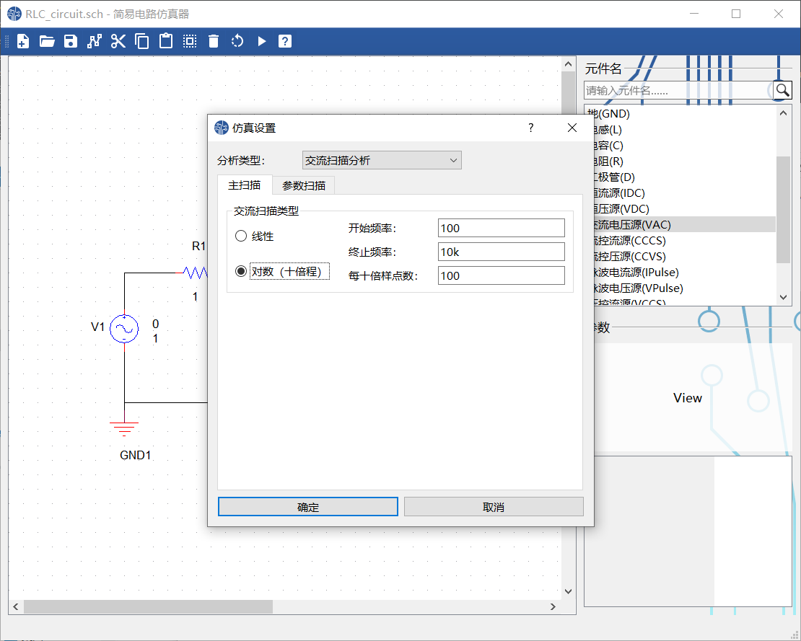
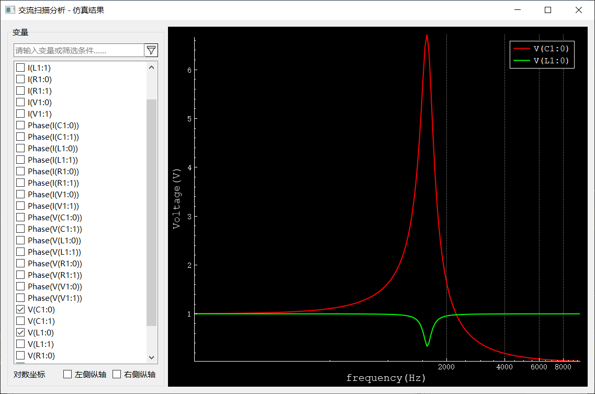

程设小学期的大作业。。。

# 编译说明

编译环境：Windows 10操作系统，Qt 5.12.0 (MSVC2017 64bit)。

直接打开`spice.pro`运行即可编译。

# 其他说明

程序中的元件图片来自Cadence软件，按钮图标来自https://materialdesignicons.com/。程序使用QCustomPlot插件进行图像绘制。

# 界面

# 使用帮助

欢迎使用简易电路仿真器！本程序主要实现了**简单电路的原理图构建与仿真分析**（包括时域分析、直流分析、交流分析）。

为便于操作，本程序为绝大多数部件提供了鼠标悬停提示气泡，可将鼠标悬停于部件上方以获得简要帮助提示；示例文件在`examples`文件夹中；程序的具体操作步骤亦可参看程序同一文件夹下的*演示视频*（`演示视频.mp4`）。

- 原理图操作

  - 双击主界面右侧**元件名**栏目中的元件列表项，即可在原理图绘制区域添加一个元件；程序设置了添加“地”快捷键`G`；可通过元件列表上方的**搜索**框搜索所需元件。移动鼠标，可将元件移动至合适位置；单击鼠标，即可放置元件。放置过程中，原理图上出现的红色圆圈代表该元件与其相连。

  - 选定元件，双击元件旁的**标注**对元件名、元件参数进行编辑，亦可通过主界面右下角的参数表格进行编辑。点击主界面上的“**旋转**”按钮（快捷键`R`），可旋转该元件。

  - 点击主界面上的“**连线**”按钮（快捷键`W`），即可绘制连线。单击确定连线起点，移动鼠标至连线终点，并再次单击，即可完成绘制。若要中途放弃绘制，可按`Esc`键退出。绘制过程中，原理图上出现的红色圆圈代表连线与其相连。

  - 点击主界面上的“**保存**”按钮（快捷键`Ctrl+S`），可保存原理图（文件后缀名`.sch`）。若当前原理图未被保存过，则程序弹出对话框，以询问保存路径及文件名。

  - 点击主界面上的“**新建**”按钮（快捷键`Ctrl+N`），可新建原理图。若当前原理图尚未保存，则程序弹出对话框，以询问是否保存。

  - 点击主界面上的“**打开**”按钮（快捷键`Ctrl+O`），可打开原理图，应选择后缀名为`.sch`的文件。若当前原理图尚未保存，则程序弹出对话框，以询问是否保存。

  - 选定原理图上的部分部件（元件或连线），可对其进行拖动操作；点击主界面上的“**剪切**”按钮（快捷键`Ctrl+X`）、“**复制**”按钮（快捷键`Ctrl+C`）、“**删除**”按钮（快捷键`Delete`或`Backspace`），可进行选定部件的剪切、复制或删除。

    点击主界面上的“**全选**”按钮（快捷键`Ctrl+A`），可选定原理图上的所有部件。

    点击主界面上的“**粘贴**”按钮（快捷键`Ctrl+V`），可粘贴剪贴板中的部件，单击鼠标以放置。剪切、复制、粘贴的内容可在两个仿真器程序间传递。

    上述操作亦在原理图的**右键菜单**中列出。

- 仿真操作

  点击主界面上的“**运行仿真”**按钮（快捷键`F11`），可进行仿真。

  - 仿真前，将**自动保存**原理图，并在同一目录下生成网表文件，名称为`[原理图文件名] - netlist.txt`。
  - 在弹出的“**仿真设置**”对话框中，可在上方的下拉菜单中选择**仿真类型**，依照程序提示**设置仿真参数**，点击“**确定**”开始仿真。
  - 本程序主要仿真功能
    - **时域分析**。
    - **直流扫描分析**：可指定除地外任意元件的任意参数进行扫描分析，并提供线性、对数（十倍程）扫描两种模式。除主扫描外，还可开启**副扫描**，确保主、副扫描变量不相同即可。
    - **交流扫描分析**：提供线性、对数（十倍程）扫描两种模式，对电路中所有VAC元件的频率进行扫描分析。除主扫描外，还可开启**参数扫描**。
  - 注意：
    - 电路中应避免形成电压源与电感的回路，否则将导致计算失败。
    - 若计算不收敛，尝试将仿真步长调小，或调整电路参数，或将元件管脚以一个较大电阻接地，以解决问题。

- 仿真结果

  - 仿真结果界面

    界面左侧为输出选项。

    - 上方的输入框为**筛选器**，可筛选指定变量。

    - 变量列表列出电路中所有变量名称，包括每个元件各个管脚处的电流、电压（交流分析中，还提供了电流、电压的相位）。勾选变量名前的**复选框**，即可绘制对应图像；**可多选**。

    - 对于时域分析，可在**“横轴变量”**处选择横轴变量（默认为时间`time`），双击变量列表中的某个变量，即可自动填充至编辑框中；

      编辑框右侧为**FFT**选项，若勾选，则绘制当前选定变量的FFT分析结果。

    - 底部为坐标形式，可勾选对应坐标轴复选框，将该轴显示为**对数坐标**。

    界面右侧为绘制区，左侧纵轴为电压轴（在交流分析中也可能为相位轴），右侧纵轴为电流轴。

    - 鼠标悬停于图像某区域，**滚动鼠标滚轮**可实现图像的缩放；鼠标悬停于坐标轴，滚动鼠标滚轮可实现坐标轴缩放。
    - 可用鼠标**拖动**图像或坐标轴，以改变显示范围。

  - 对于时域分析，程序将各元件各个管脚**直流工作点**的电压、电流分别以黄、蓝两种颜色进行标记，标记均保留4位有效数字。
